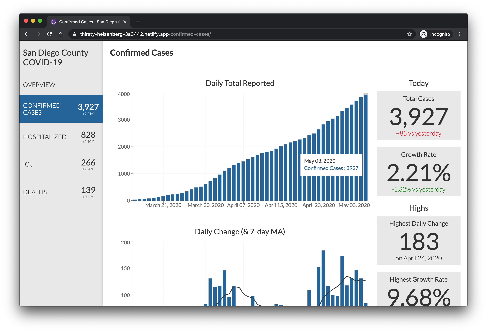

# San Diego County COVID 19
A basic [Gatsby](https://www.gatsbyjs.org)-generated site for quick visualization of the daily COVID 19 data published on the [San Diego County site](https://www.sandiegocounty.gov/content/sdc/hhsa/programs/phs/community_epidemiology/dc/2019-nCoV/status.html)

## Project Setup

Initially, this project was started with [Gatsby's default starter](https://github.com/gatsbyjs/gatsby-starter-default) (still some unused remnants lying around in this codebase, in fact). When in doubt, the [Gatsby documentation](https://www.gatsbyjs.org/docs/) is a great place to start.

### Requirements
- Node (at the time of writing: `v13.12.0`)
- NPM or Yarn (at the time of writing: `NPM 6.14.4`)
- Access to the Google Sheet referenced in the config or a correctly structured sheet (see Data below)
- Google Drive service account from [Google API Console](https://console.developers.google.com/). (A bit out of date but follow first part of [this tutorial](https://www.twilio.com/blog/2017/03/google-spreadsheets-and-javascriptnode-js.html))

### Installing and Running
1. After cloning and `cd`-ing into the project's directory, run `npm install` to install the node modules.
2. Create `.env` file at the root of the project with the key `GOOGLE_AUTH_COVID_19`. That key should point to a base-64 encoded string of the `client_secret.json` recieved from getting Google Drive API access.
3. Run either `gatsby develop` or `npm run develop` to start the local server.
4. Site should now be accessible at [localhost:8000](http://localhost:8000).

## Data

### Source and structure

The data from the county site is collected daily and stored in a Google Sheet. The Google Sheet then acts as a database for this project to consume. The structure of the sheet:

| Date reported | Confirmed Cases | Hospitalized | ICU | Deaths |
| ------------- | --------------- | ------------ | --- | ------ |
| ...           | ...             | ...          | ... | ...    |
| 4/14/2020     | 1930            | 450          | 164 | 53     |
| 4/15/2020     | 2012            | 488          | 173 | 60     |
| 4/16/2020     | 2087            | 507          | 181 | 63     |
| ...           | ...             | ...          | ... | ...    |

### Updating the data

There are a handful of Google Apps Scripts attached to the sheet to automate the data updates. The main update function has been added to the menu on the sheet: `External Functions` -> `Get updated data`.

Running the `Get updated data` function checks the last date reported row in the sheet and compares it with the data from the county's site. If there is newer data, it adds a row with the updated data.

A copy of the scripts attached to the sheet can be found at the root of this project in `google-scripts.js`.

## Development

Run `gatsby develop` or `npm run develop` to run the local Gatsby dev server. Visit the local site and updates to the code should be reflected in the browser via HMR (unless a server restart is needed, obviously). The dev process is fairly standard for Gatsby; check the [docs](https://www.gatsbyjs.org/docs/) for more info.

There are two areas that deviate from Gatsby defaults & typical setup: stylesheets and js linting.

### Stylesheets

The stylesheets are all stored in the `src/styles` directory. The organization of the style partials is based on ITCSS principles (with naming inspired by [GE's Predix Design System](https://medium.com/ge-design/ges-predix-design-system-8236d47b0891)). The individual partials are imported into the manifest file `app.sass`.

`app.sass` is imported into the main layout component (`src/components/layout.js`), which means that all of the styles are available on every page. For this small-sized project, it's not an issue, but this isn't a pattern that scales well. So consider converting to modules and importing as needed if development continues.

### JS linting

This project is set up with eslint using _(mostly)_ Airbnb's Javascript style guide. The default Gatsby starter and Airbnb disagree on quite a few conventions (like semi-colons and quote marks, for instance).

The primary deviation from Airbnb's style guide regards trailing commas. The Airbnb guide requires trailing commas. On this project, per rules in `.eslintrc.json`, trailing commas are _allowed_ on multiline properties, but _never_ required.

The custom eslint should automatically run as part of the develop script (via `gatsby-plugin-eslint`). And the default `.prettierrc` file has been lightly retouched to agree with Airbnb.

## Build

Run `gatsby build` to build a local version of what will be produced when deploying. Useful if you want to check the output of the build, but this is rarely done locally. The `public/` directory it creates is excluded from git.

## Deploy

The site is hosted with [Netlify](https://www.netlify.com/). Netlify has access to the repo and, on deploy, automatically runs the build and deploys the production version of the site.

A deploy is triggered when:
- there is a commit to the master branch in Github
- the `Deploy Site` command is run from the Google Sheet (which simply pings a webhook)
